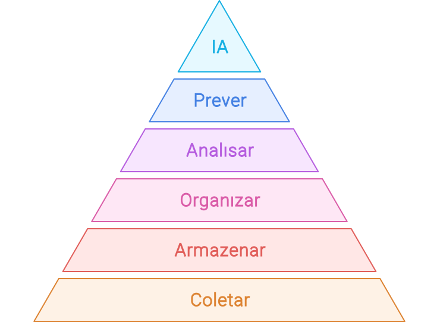

import LigaHighlight from '@site/src/components/gsap/highlight'

# Inteligência e análise de dados
<LigaHighlight />
A implementação da inteligência artificial (IA) em uma organização deve ser conduzida com uma abordagem gradual e estratégica. Isso não significa que o processo deva ser lento, mas sim que deve seguir um ritmo contínuo e evolutivo, permitindo que a organização e sua infraestrutura se adaptem adequadamente. Ao estabelecer uma base sólida, o crescimento se torna mais sustentável e os riscos de fracasso, devido à falta de experiência, recursos ou infraestrutura inadequada, são reduzidos.

Atualmente, a IA generativa, especialmente os modelos de linguagem, proporciona resultados rápidos e tangíveis sem demandar grandes investimentos iniciais em infraestrutura e capacitação. Isso cria uma oportunidade imediata para que as organizações obtenham benefícios a curto prazo. No entanto, <spam class="text-highlight">para iniciativas mais ambiciosas</spam>, como o desenvolvimento de modelos próprios de IA, é essencial que a organização tenha uma <spam class="text-highlight">base sólida em análise de dados</spam> (BI). Antes de considerar projetos mais complexos, os líderes da organização devem se perguntar: estamos prontos para enfrentar a complexidade da personalização ou da construção de nossos próprios modelos de IA?

O sucesso de qualquer iniciativa de IA depende diretamente da qualidade dos dados que a alimentam. Antes de avançar para projetos mais ambiciosos, é essencial que a organização <spam class="text-highlight">desenvolva uma base sólida de dados</spam>. Isso envolve aprimorar a capacidade de coletar, organizar e analisar dados, extraindo *insights* valiosos por meio de estratégias robustas de *analytics* e *Business Intelligence* (BI).

Esse aprimoramento é um passo importante para preparar a organização para o uso transformador da IA. Monica Rogati, cientista de dados, observou que [muitas empresas ainda <spam class="text-highlight">não estão prontas</spam> para um uso avançado da IA](https://medium.com/hackernoon/the-ai-hierarchy-of-needs-18f111fcc007). Para ilustrar essa ideia, ela propôs a Hierarquia das Necessidades em Ciência de Dados (*Data Science Hierarchy of Needs*). Inspirado na pirâmide de Maslow, esse modelo sugere que os níveis mais avançados de IA só podem ser atingidos após a consolidação de fundamentos essenciais, como infraestrutura de dados, integração e análise.

*Versão adaptada da Hierarquia das Necessidades em Ciência de Dados.*

Em outras palavras, avançar na implementação da IA sem uma fundação sólida em dados é como construir um edifício sem alicerces adequados. Ao fortalecer os fundamentos de dados, sua organização estará <spam class="text-highlight">mais preparada</spam> para utilizar a IA de maneira eficaz, minimizando riscos e maximizando o retorno sobre o investimento.

**Coletar, armazenar e organizar os dados:** O primeiro passo é garantir que sua organização possua um sistema robusto para coleta e armazenamento de dados. Isso envolve não apenas a implementação das tecnologias certas, mas também a definição de processos claros para assegurar que os dados sejam coletados de forma consistente e precisa. A organização adequada dos dados é fundamental para garantir a confiabilidade das análises subsequentes.

**Extraindo *Insights* via *Analytics***: Com os dados bem coletados e organizados, o próximo passo é utilizar ferramentas de *analytics* para extrair *insights* valiosos. Essas ferramentas proporcionam uma visão clara e aplicável sobre diversos aspectos do negócio, como comportamento do cliente, eficiência operacional e tendências de mercado. Os *insights*, obtidos a partir de uma análise cuidadosa dos dados, costumam ser mais acessíveis e fáceis de interpretar do que os resultados de sistemas de IA complexos, oferecendo ganhos rápidos e significativos.

**Preparando o Terreno para a IA:** Desenvolver uma competência sólida em coleta de dados e *analytics* é essencial para preparar a organização para níveis mais avançados da "hierarquia", como aprendizado de máquina e IA. Com uma base de dados limpa, a aplicação de IA se torna muito mais eficaz e menos arriscada. Isso ocorre porque a IA depende de dados de alta qualidade e bem estruturados para gerar resultados mais precisos e confiáveis.

**Redução de Riscos e Melhor Tomada de Decisão:** Iniciar com a coleta e análise de dados antes de personalizar ou desenvolver modelos próprios de IA reduz significativamente os riscos associados a grandes investimentos nestas tecnologias. Além disso, ao compreender melhor os dados e os *insights* que eles geram, os líderes executivos podem tomar decisões mais informadas e estratégicas, pavimentando o caminho para uma adoção bem-sucedida da IA no futuro.

**Economia de Recursos e Tempo:** Investir tempo e recursos na construção de uma base sólida de dados resulta em economias a longo prazo. Erros e retrabalhos são minimizados, e as implementações de IA se tornam mais rápidas e eficazes, já que os dados estão devidamente preparados e organizados.

Para concluir a minha sugestão é: enquanto você aprende com a implementação de ferramentas prontas de IA generativa, comece pela base da *Data Science Hierarchy of Need*s — coletar, organizar e analisar dados. Esse enfoque não apenas facilita a aplicação de IA, mas também oferece *insights* valiosos de maneira mais rápida e simples, preparando a organização para os desafios e oportunidades que a inteligência artificial trará.
