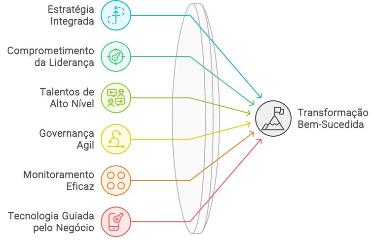

import LigaHighlight from '@site/src/components/gsap/highlight'
import useBaseUrl from '@docusaurus/useBaseUrl';

# Transformação digital
<LigaHighlight />
Hoje, a continuidade dos negócios está cada vez mais em risco. Uma pesquisa da PwC revela que quase <spam class="text-highlight">metade dos CEOs</spam> compartilham essa preocupação, impulsionada pela rápida evolução do perfil dos clientes, pela crescente concorrência e, acima de tudo, pelas transformações tecnológicas. Em resposta, muitos executivos têm acelerado a adoção de tecnologias emergentes, como a Inteligência Artificial (IA), com o objetivo de otimizar processos ou até mesmo reinventar seus modelos de negócio.

>*A pesquisa deste ano mostra que a preocupação dos CEOs com a continuidade de seus negócios aumentou, mesmo após iniciarem mudanças importantes. Embora estejam mais otimistas em relação ao crescimento econômico global do que no ano passado, 41% dos respondentes no Brasil (45% no mundo) continuam não acreditando que suas organizações sobreviverão por mais de dez anos se mantiverem o rumo atual.  Fonte: [PwC's 27th Annual Global CEO Survey](https://www.pwc.com.br/pt/estudos/preocupacoes-ceos/ceo-survey-2024.html).*

No entanto, incorporar a IA à sua organização vai muito além de uma simples atualização tecnológica. A IA tem o potencial de transformar profundamente diversos aspectos do seu negócio, desde a maneira como você interage com os clientes até a eficiência de suas operações. Mas para que esses benefícios se concretizem, é essencial entender que a adoção da IA deve ser vista como parte de uma iniciativa mais ampla de <spam class="text-highlight">transformação digital</spam>.

## Riscos da transformação digital
A transformação digital é um processo complexo que envolve não apenas a adoção de novas tecnologias, mas também <spam class="text-highlight">mudanças profundas</spam> na cultura organizacional, nos processos e nas estratégias de mercado. Essa jornada não é fácil: estudos indicam que até <spam class="text-highlight">70% das iniciativas de transformação digital falham</spam> em atingir seus objetivos. O sucesso depende de uma abordagem integrada que considere os aspectos tecnológicos, culturais, de negócios e operacionais da organização.

*Principais fatores de sucesso para a transformação digital, segundo estudo da consultoria [BCG](https://www.bcg.com/publications/2020/increasing-odds-of-success-in-digital-transformation).*

## Estratégias para o sucesso
:::tip Dica #1

Entenda os *frameworks* de transformação digital.

:::
Dado o alto risco de falhas, é fundamental que sua organização esteja bem preparada para os desafios. Diversos *frameworks* foram desenvolvidos por grandes consultorias para guiar o processo de transformação digital. Dedicar um tempo para conhecer pelo menos um desses *frameworks* pode ser um grande diferencial na hora de planejar sua estratégia.

:::tip Dica #2

Alinhe os modelos de negócio, operacional e tecnológico.

:::
Para que a IA traga os resultados esperados, é essencial que seu modelo de negócio esteja alinhado com os modelos operacional e tecnológico, garantindo que a tecnologia sirva aos objetivos estratégicos da empresa. Por exemplo, sua infraestrutura atual suporta as mudanças necessárias? Seus processos operacionais estão preparados para maximizar o uso da nova tecnologia? Essas perguntas devem ser respondidas antes de seguir adiante com a adoção da IA.

:::tip Dica #3

Planeje com cuidado.

:::
A empolgação em torno da IA é grande, mas a chave para uma implementação bem-sucedida está em <spam class="text-highlight">fazer as perguntas certas</spam> desde o início. Quais são os objetivos específicos que a IA deve alcançar? Qual será o retorno sobre o investimento? Sua organização tem o know-how e a infraestrutura necessários? Como a IA afetará os processos existentes e quais são os riscos envolvidos?
A implementação da IA deve ser acompanhada de uma avaliação contínua dos impactos, permitindo ajustes necessários ao longo do caminho para garantir que os objetivos estratégicos sejam alcançados. E, finalmente, existe um plano de comunicação e treinamento para engajar todos os colaboradores?

# Maturidade tecnológica
A adoção da IA pode ser uma poderosa alavanca para o sucesso de sua organização, mas somente se for tratada como parte de uma transformação digital mais ampla, ajustada ao nível de maturidade tecnológica da sua organização. Isso requer uma abordagem estratégica e integrada, que leve em conta não apenas a tecnologia, mas também as mudanças culturais, operacionais e estratégicas necessárias para que a IA atinja seu pleno potencial.

Organizações com diferentes níveis de maturidade tecnológica precisarão adaptar suas estratégias de acordo, seja fortalecendo sua infraestrutura tecnológica ou refinando processos já estabelecidos. Prepare-se, estude e planeje. A verdadeira <spam class="text-highlight-end">transformação começa com uma visão clara, uma avaliação realista de suas capacidades e uma execução cuidadosa</spam>.